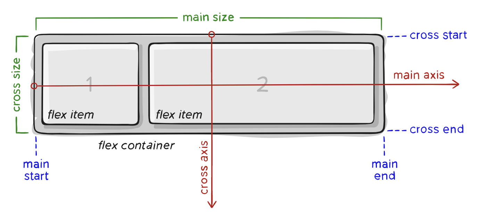

# Flexbox

## Terminology

- **Flex container** : flex, flex-direction, flex-wrap, gap
- **main axis** : justify-content
- **cross axis** : align-content
- **Flex item** : flex-grow, order



## Properties for the Parent (flex container)

**display**

- It enables a flex context for all its direct children.

```css
.container {
  display: flex; /* or inline-flex */
}
```

**flex-direction**

- This establishes the main-axis.

```css
.container {
  flex-direction: row | row-reverse | column | column-reverse;
}
```

**flex-wrap**

- By default, flex items will all try to fit onto one line. You can change that and allow the items to wrap.

```css
.container {
  flex-wrap: nowrap | wrap | wrap-reverse;
}
```

**flex-flow**

- This is a shorthand for the flex-direction and flex-wrap properties, which together define the flex container’s main and cross axes.

```css
.container {
  flex-flow: column wrap | row nowrap;
}
```

**justify-content**

- This defines the alignment along the main axis.

```css
.container {
  justify-content: flex-start | flex-end | center | space-between | space-around
    | space-evenly | start | end | left | right;
}
```

**align-items**

- This defines the default behavior for how flex items are laid out along the cross axis

```css
.container {
  align-items: stretch | flex-start | flex-end | center | baseline | first
    baseline | last baseline | start | end | self-start | self-end;
}
```

**align-content**

- This aligns a flex container’s lines within when there is extra space in the cross-axis.

```css
.container {
  align-content: flex-start | flex-end | center | space-between | space-around |
    space-evenly | stretch | start | end | baseline | first baseline | last
    baseline;
}
```

**gap**

- The gap property explicitly controls the space between flex items

```css
.container {
  display: flex;
  ...
  gap: 10px;
  gap: 10px 20px; /* row-gap column gap */
  row-gap: 10px;
  column-gap: 20px;
}
```

## References:

- https://css-tricks.com/snippets/css/a-guide-to-flexbox/
