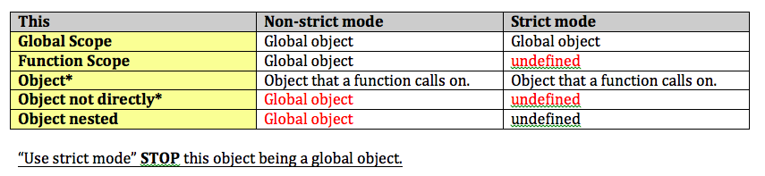

# ES6 Fat Arrow
- Fat arrow functions are far more than just a way of writing anonymous functions.
- It also stabilises the value of `this`

**Q1**
- Re-write anonymouse function in `setTimeout` argument using fat arrow function
```js
setTimeout(function(){
    console.log("SetTimeout called")
}, 1000);
```

**Q1-Answer**

```js
setTimeout(()=> console.log("SetTimeout called"), 1000);
```

<hr>

**Q2**
- Re-write fat arrow function.

```js
//ES5
let add = function(a,b){
    return a+b;
}
```

**Q2-Answer**
- If the body is just one line, we can remove braces`{}`.
- If the body is just one line, we don't need "return" - it's automatically returning a value of function.

```js
let add = (a,b)=>a+b;
```

<hr>

**Q3**
- Object ES5 with `this` value

```js
let obj = {
    name: "Asim",
    sayLater: function() {
        console.log(this.name);
    }
};
obj.sayLater(); 
```

**Q3-Answer**
```js
obj.sayLater(); //Asim
```

<hr>

**Q4**
- Object with fat arrow funciton for `this` value
- Fat arrow function will be the SAME as the value of this of the outside the fat arrow function

**ES5**
```js
let obj = {
    name: "Asim",
    sayLater: function() {
        setTimeout(function(){ //ES5 function syntax
            console.log(this.name); // What is value? 
        }, 1000);
    }
};
obj.sayLater(); //undefine
```
**ES6**
```js
let obj = {
    name: "Asim",
    sayLater: function() {
        setTimeout(() => console.log(this.name) , 1000);
    }
};
obj.sayLater();
```

**Q4-Answer**
```js
// ES5
obj.sayLater(); //undefine
// ES6 with Fat arrow function
obj.sayLater();//Asim
```
**ES5 - `This` value** 
With fat arrow function, unstable `This` value has been fixed.


<hr />

**Q5**
```js
const multiplier1 = {
  numbers: [1,2],
  multiplyBy: 3,
  multiply(){    
      const output = this.numbers.map(function(num){ // Not fat arrow function
        console.log(this.multiplyBy); // undefine
        return num * this.multiplyBy
      });
      return output;
  }
}
multiplier1.multiply(); //?
```
```js
const multiplier2 = {
  numbers: [1,2],
  multiplyBy: 3,
  multiply(){
      var _self = this;   // Save "this" value HERE!!!
      const output = this.numbers.map(function(num){ // Not fat arrow function
        console.log(_self.multiplyBy); // undefine
        return num * _self.multiplyBy
      });
      return output;
  }
}
multiplier2.multiply(); // ? 
```
**Q5: Answer**
- multiple1 is error because this is `undefine` inside map() callback function!
```js
console.log(multiplier1.multiply()); // [ NaN, NaN ] 
console.log(multiplier2.multiply()); // [ 3, 6 ]
```

## Udemy - fat arrow fucntion
- **In fat arrow function `this` value is used its parents this value.**
- `funtion` keyword goes away.
- Function body is `{}`
- ES6 arrow function is always **anonymouse function**.
- It's concise version


**Challenge1**
- Use arrow functions
- getFirstName('Mike Smith')-> Mike


**Challenge1-Answer**
```js
const getFirstName = (fullname) => fullname.split(' ')[0];
console.log(getFirstName('Mike Smith'));
```
<hr>


**Challenge2**
```js
const multiplier = {
    // numbers - array of number
    // multiplyBy - single number
    // multiply - returns a new array where the nubmer has been multiplied
}
```

**Challenge2-Answer-1**

```js
const multiplier = {
    numbers: [1,2],
    multiplyBy: 3,
    multiply(){ //ES6 Method Definition syntax - `this` value refers its parents "this" value      
        const output = this.numbers.map((num) => num * this.multiplyBy);
        return output;
    }
}
console.log(multiplier.multiply()); //[3,6]
```


**Challenge2-Answer-2**
```js
const multiplier = {
    numbers: [1,2],
    multiplyBy: 3,
    multiply: function(){ // ES5 function syntax - `this` refers its parent "this" value
        const output = this.numbers.map((num) => num * this.multiplyBy);
        return output;
    }
}
console.log(multiplier.multiply()); //[3,6]
```

**Challenge2-Answer-3**
```js
const multiplier = {
    numbers: [1,2],
    multiplyBy: 3,
    multiply: () => { // ERROR - DO NOT USE fat arrow function HERE because it loses `this` value
        const output = this.numbers.map((num) => num * this.multiplyBy);
        return output;
    }
}
console.log(multiplier.multiply()); //ERROR
```


