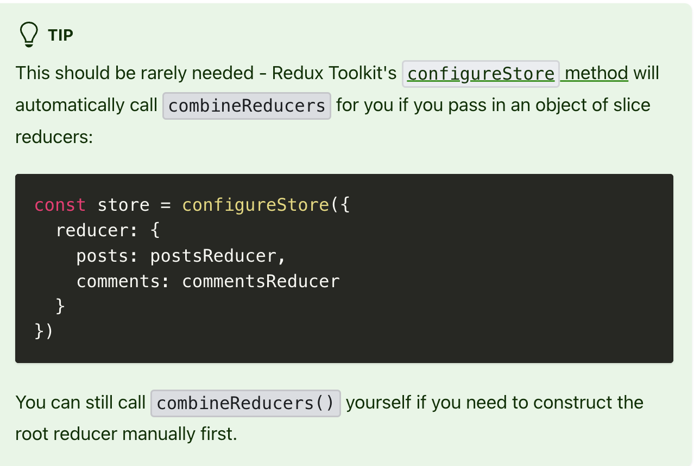

# Redux Toolkit

- [Redux Toolkit Quick Start](https://redux-toolkit.js.org/tutorials/quick-start)

## Installation

- Need to install two packages, `@reduxjs/toolkit` and `react-redux`.

```
npm install @reduxjs/toolkit react-redux
```

## React Toolkit - configureStore

> Redux Toolkit's configureStore method will automatically call combineReducers. So configureStore replaced with combineReducer().



```
import { configureStore } from '@reduxjs/toolkit'

const store = configureStore({
  reducer: {
    posts: postsReducer,
    comments: commentsReducer
  }
})
```

## react-redux

- A React-Redux <Provider> and put your application around.

```
import { Provider } from 'react-redux'

ReactDOM.render(
<Provider store={store}>
  <App />
</Provider>,
document.getElementById('root')
)
```
