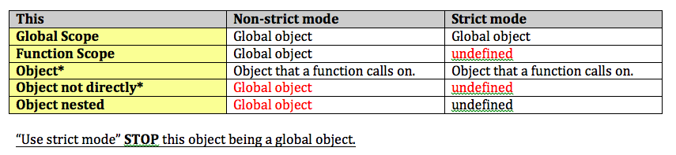

# What is "use strict"?

1. A variable must declare using `var` keyword, which could avoid accidentally creating global variables.
2. User strict mode **STOP `this` being a global valuable** and set "**undefined**" as default value.

- Look at below table. In JavaScript, this is unstable and it is different how this is called. In Non-strict mode, this refers a global valuable and most of the case, it is confused and stop being as a global valuable.   



## Global Scope

**Non-strict mode**
```js
console.log(this); // Window Object
```

**Strict mode**
```js
"use strict";
console.log(this); // Window Object
```

## Function Scope
**Non-strict mode**

```js
function test(){
    console.log(this);
}
test();// Window object
```

**Strict mode**
```js
"use strict";
function test(){
    console.log(this);
}
test();// undefined
```
"strict mode" set "**undefined**" as default value.