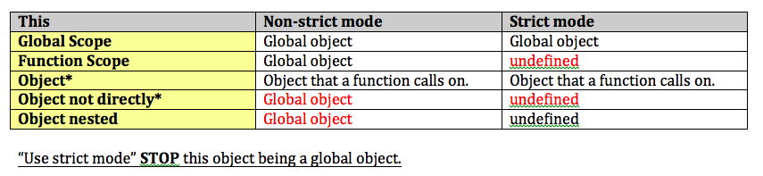

# this



## Global Scope

**Non-strict mode**
```js
console.log(this); // Window Object
```

**Strict mode**
```js
"use strict";
console.log(this); // Window Object
```

## Function Scope
**Non-strict mode**

```js
function test(){
    console.log(this);
}
test();// Window object
```

**Strict mode**
```js
"use strict";
function test(){
    console.log(this);
}
test();// undefined
```

- In strict mode, the default value of this is `undefined`. Use strict mode **STOP this object being the global object** becuase most of the time, we don't want this to be a global object. 
## In Object (`this` is called in a function of Object)

**Non-strict mode**
```js
var person = {
    name: "Hiroko",
    getName: function(){
        console.log(this.name);
    },
    prop:{
        name: "Grace",
        getName: function(){
            console.log(this.name);
        }  
    }
}

person.getName();//hiroko
person.prop.getName(); //Grace
```

**Strict mode**
```js
"use strict";
var person = {
    name: "Hiroko",
    getName: function(){
        console.log(this.name);
    },
    prop:{
        name: "Grace",
        getName: function(){
            console.log(this.name);
        }  
    }
}

person.getName();//hiroko
person.prop.getName(); //Grace
```

## In Object but not directly called.

**Non-strict mode**
```js
var name = 'Tom';
var person = {
    name: "Hiroko",
    getName: function(){
        console.log(this.name);
    },
};

var func = person.getName;
func();//Tom
```

**Strict mode**
```js
"use strict";
var name = 'Tom';
var person = {
    name: "Hiroko",
    getName: function(){
        console.log(this.name);
    },
};

var func = person.getName;
func(); //Cannot read property 'name' of undefined
```

## In Object with a nested function

**Non-strict mode**
```js
var person = {
    name: "Hiroko",
    getName: function(){
        console.log(this.name);
        function checkNexted(){
        	console.log(this);
        }
        checkNexted();
    },
};

person.getName();
//Hiroko
// Window
```

**Strict mode**
```js
"use strict";
var person = {
    name: "Hiroko",
    getName: function(){
        console.log(this.name);
        function checkNexted(){
        	console.log(this);
        }
        checkNexted();
    },
};

person.getName();
// Hiroko
// undefined
```
## Summary


## Excercise

**Non strict mode**
```js
var fullname = 'John Doe';
var obj = {
   fullname: 'Colin Ihrig',
   prop: {
      fullname: 'Aurelio De Rosa',
      getFullname: function() {
         return this.fullname;
      }
   }
};

console.log(obj.prop.getFullname());// Aurelio De Rosa
var test = obj.prop.getFullname; 
console.log(test()); //John Doe
```

**Strict mode**

```js
"use strict";
var fullname = 'John Doe';
var obj = {
   fullname: 'Colin Ihrig',
   prop: {
      fullname: 'Aurelio De Rosa',
      getFullname: function() {
         return this.fullname;
      }
   }
};

console.log(obj.prop.getFullname());// Aurelio De Rosa
var test = obj.prop.getFullname; 
console.log(test()); //undefined
```