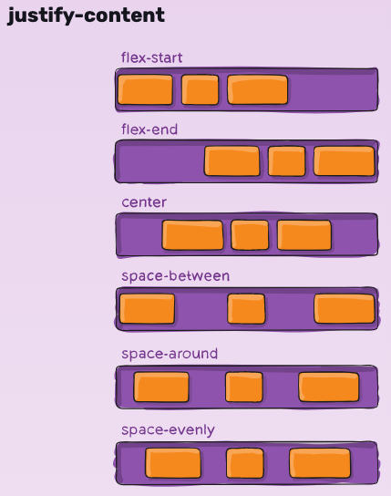
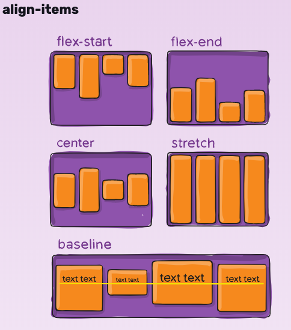

# @material-ui/styles
## How to pass props to makeStyles

Example 1 - Turn on/off border

```js

const TestPage = () =>{
 return (
  <PageHeader
   title="About"
   icon={<CloseIcon />}
   border //<--- 1. PageHeader has a border props.
   />
 )
}
```

```js
import { makeStyles } from "@material-ui/core/styles";

const useStyles = makeStyles(theme =>({
  root: {
    borderBottom: props => props.border ? "1px solid green" : null
  }
}));

const PageHeader = (props) =>{
  const {icon, title, border, ...rest} = props;
  const classes = useStyles({border}) //<--- 2. Pass "border" props to `useStyle`
  
  return (
    <div className={classes.root}>
      <h1>{title}</h1>
    </div>
  )
}


```

https://material-ui.com/styles/basics/#adapting-based-on-props


# Flexbox 

The flex container properties are:

- flex-direction
- flex-wrap
- flex-flow
- justify-content
- align-items
- align-content


## flex-direction/flex-wrap
- How the flex items stack
  
**vertically**
```css
.flex-container {
  display: flex;
  flex-direction: column
}
```

**horizontally**
```css
.flex-container {
  display: flex;
  flex-direction: row;
}
```

**wrap**
```css
.flex-container {
  display: flex;
  flex-wrap: wrap;
}
```

**shorthand**
```css
.flex-container {
  display: flex;
  flex-flow: row wrap;
}
```

## justify-content
how the flex items align horizontally.

```css
.flex-container {
  display: flex;
  justify-content: 
| center
| flex-start
| frex-end
| space-around (space before, between and after)
| space-between (space between the lines:)
| space-evenly
}
```

## align-items
how the flex items align vertically.

```css
.flex-container {
  display: flex;
  align-items: 
  stretch 
  | flex-start 
  | flex-end 
  | center 
  | baseline
}
```






## flex-grow
- The flex-grow property specifies how much the item will grow relative to the rest of the flexible items inside the same container.


### References:

- [CSS-TRICS](https://css-tricks.com/snippets/css/a-guide-to-flexbox/)
- [Flexbox](https://www.w3schools.com/css/css3_flexbox.asp)
- [flex-flow Play it](https://www.w3schools.com/cssref/playit.asp?filename=playcss_flex-flow)
- [flex-grow](https://www.w3schools.com/cssref/css3_pr_flex-grow.asp)
